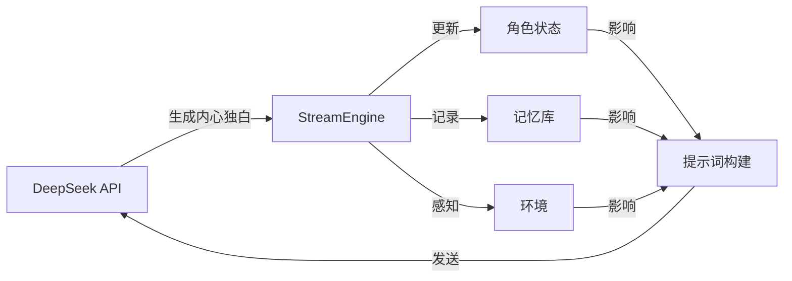

# Infinity Alive

> 基于 DeepSeek API 的 AI 角色生命模拟器 — 让 AI 角色在环境中自主思考、产生记忆、演化情绪。

---

## 快速开始

### 环境要求

- **PowerShell 7.0+**（Windows / macOS / Linux 均可）
- **Git**（用于拉取构建工具链）
- **DeepSeek API Key**（[申请地址](https://platform.deepseek.com/)）

### 1. 设置 API 密钥

```powershell
# 方式一：环境变量（推荐）
$env:DEEPSEEK_API_KEY = "sk-your-api-key-here"

# 方式二：运行时通过 -ApiKey 参数传入
```

### 2. 一键构建

```powershell
.\setup.ps1
```

该脚本会自动完成：
1. 拉取/更新 `infinity_build` 构建工具
2. 编译 `src/` 下的源码，生成 `infinity_alive.ps1`

> 如需 Release 模式构建：`.\setup.ps1 -Mode Release`

### 3. 启动 AI 角色

```powershell
.\infinity_alive.ps1 `
    -CharacterName "伊莎" `
    -Personality "你是一个住在海边灯塔的孤独诗人，言语温柔但常陷入忧伤。" `
    -Environment "灯塔顶层，傍晚，窗外海浪拍打礁石，风声呜咽" `
    -MinInterval 8 -MaxInterval 30 `
    -LogFile live.mem
```

角色便会开始自主产生内心独白，输出到终端并写入日志文件。

---

## 命令行参数

| 参数 | 类型 | 必选 | 默认值 | 说明 |
|------|------|------|--------|------|
| `-CharacterName` | `string` | ✓ | — | 角色名称 |
| `-Personality` | `string` | ✓ | — | 角色性格描述 |
| `-Environment` | `string` | ✗ | `"一间安静的房间里"` | 初始环境描述 |
| `-Model` | `string` | ✗ | `deepseek-v4-flash` | 模型选择：`deepseek-v4-flash` / `deepseek-v4-pro` |
| `-ApiKey` | `string` | ✗ | `$env:DEEPSEEK_API_KEY` | DeepSeek API 密钥 |
| `-MinInterval` | `int` | ✗ | `10` | 两次思考的最小间隔（秒） |
| `-MaxInterval` | `int` | ✗ | `60` | 两次思考的最大间隔（秒） |
| `-LogFile` | `string` | ✗ | — | 日志输出文件路径 |
| `-Force` | `switch` | ✗ | — | 强制执行（忽略安全提示） |

---

## 项目结构

```
infinity_alive/
├── src/                    # 源代码（.psm1 模块）
│   ├── api.psm1            # DeepSeek API 客户端
│   ├── state.psm1          # 角色状态管理
│   ├── memory.psm1         # 记忆管理
│   ├── environment.psm1    # 环境管理
│   ├── prompt.psm1         # AI 提示词构建
│   ├── stream_engine.psm1  # 流式思考引擎
│   └── main.psm1           # 入口模块
├── buildconfig.json        # 构建配置
├── setup.ps1               # 一键构建脚本
├── test.ps1                # 调试启动示例
├── infinity_build/         # 构建工具链（git 拉取，不入库）
└── infinity_alive.ps1      # 构建产物（不入库）
```

---

## 工作原理



角色在设定的时间间隔内，通过 DeepSeek API 生成内心独白。每次思考会综合考虑当前环境、过往记忆和情绪状态，并随时间演化。

---

## 许可证

MIT License
